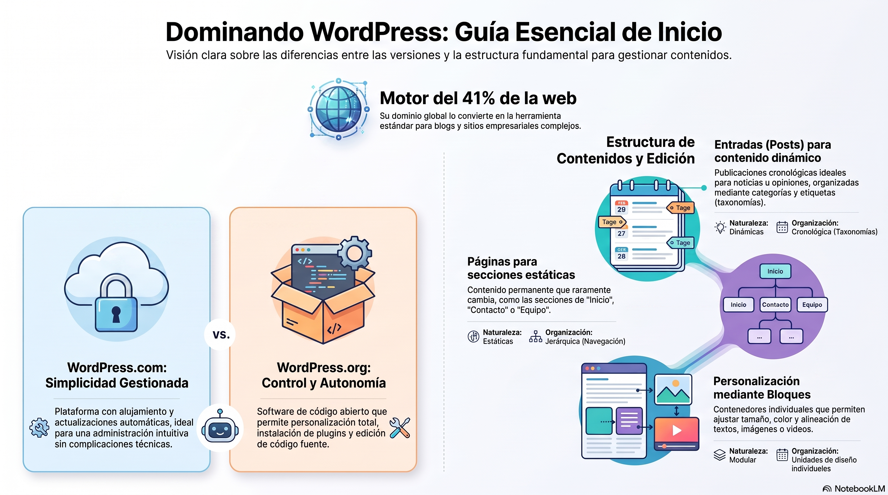

# Semana 01 - Conociendo el Administrador de Contenidos

**Experiencia:** 1 | **Asignatura:** Administración de Contenidos

---

## Introducción

WordPress es un Sistema de Gestión de Contenidos (CMS) que permite crear, gestionar y publicar contenido en línea de manera eficiente. Originalmente diseñado para blogs, hoy impulsa más del 41% de los sitios web en internet. En esta semana se distingue entre wordpress.com y wordpress.org y se da el primer acercamiento a la plataforma.

[Descargar presentación](material-clase/presentacion.pdf)
---

## Temas Tratados

- ¿Qué es WordPress? Diferencia entre wordpress.com y wordpress.org
- Creación del primer sitio web en wordpress.com
- Gestión de Entradas (Posts): creación y publicación
- Publicando la primera entrada
- Uso de Bloques (editor Gutenberg)

## Conceptos Clave

- **CMS (Content Management System):** sistema que permite gestionar contenido web sin necesitar código.
- **WordPress.com:** plataforma alojada y administrada por Automattic.
- **WordPress.org:** software libre que se instala en servidor propio.
- **Entradas (Posts):** publicaciones cronológicas del blog.
- **Bloques (Gutenberg):** unidades de contenido del editor visual de WordPress.

## Resultado de Aprendizaje

- **RA1:** Evalúa estructura de contenidos de un proyecto digital mediante mapa de navegación, a fin de utilizar de manera óptima las taxonomías del CMS.

## Referencias y Recursos

- Material Guía Semana 1: `material-semana/material-guia-semana.pdf`
- [WordPress.org](https://wordpress.org)
- [WordPress.com](https://wordpress.com)
