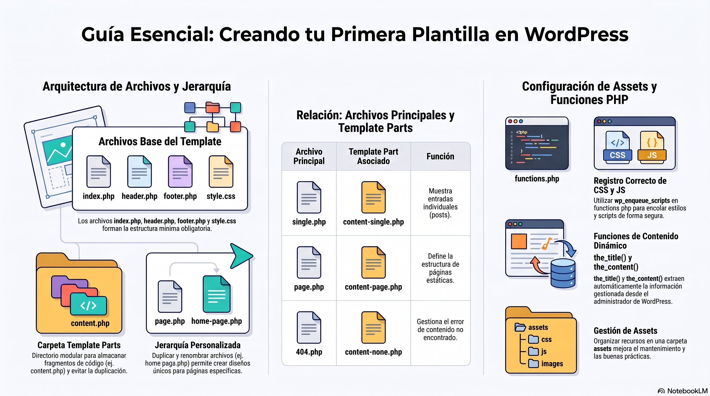

# Semana 02 — Creando mi Primera Plantilla

[Descargar presentación](material-clase/presentacion.pdf)

---

## Introducción

Esta semana damos el salto a **wordpress.org**: aprenderás a instalar WordPress en un servidor local y a crear tu primera plantilla personalizada con PHP. El objetivo es construir una presencia en línea con identidad propia y funcionalidad a medida.

---

## Instalación de WordPress en Localhost

Antes de crear un template, debes tener WordPress corriendo en tu entorno local:

- Utiliza **MAMP** o **XAMPP** para configurar un servidor local.
- Descarga WordPress desde [wordpress.org](https://wordpress.org).
- Para cargar tu template: `Panel de administración > Apariencia > Temas > Añadir nuevo`.

---

## Archivos Clave de un Template de WordPress

Todo template de WordPress se construye sobre archivos PHP fundamentales:

### `style.css`
Define los estilos visuales del tema (colores, tipografía, diseño) y contiene los **metadatos del tema** (nombre, versión, autor). Es **obligatorio**: sin él, el template no funciona. Debe tener la cabecera con `Theme Name`, `Author`, etc.

### `functions.php`
Contiene funciones PHP que personalizan y amplían la funcionalidad del tema. Aquí se registran menús, se activan características y se agregan widgets. Se complementa con **`assets.php`** para organizar y gestionar scripts y estilos de forma modular.

### `index.php`
Archivo principal del tema. Muestra el contenido central de las entradas. Es el punto de partida que define la estructura del sitio y cómo se presenta el contenido en la página principal.

### `header.php`
Define la estructura de la parte **superior** de cada página: cabecera del sitio, barra de navegación y elementos comunes a todas las páginas.

### `footer.php`
Contiene la estructura del **pie de página**: copyright, redes sociales y elementos comunes a todas las páginas.

### `single.php`
Muestra el contenido de una **entrada individual** (artículo de blog). Define cómo se ve un solo post: título, contenido, comentarios y categorías. Se vincula a `content-single.php` dentro de template parts.

### `page.php`
Muestra el contenido de **páginas individuales**. A diferencia de `single.php`, gestiona páginas estáticas. Se vincula directamente a `content-page.php`.

### `404.php`
Página de **error 404** cuando el visitante intenta acceder a contenido inexistente. Se vincula a `content-none.php` dentro de template parts.

---

## La Carpeta Template Parts

Esta carpeta almacena **archivos modulares** que se reutilizan en múltiples templates. Evita la duplicación de código y facilita el mantenimiento.

| Archivo | Función |
|---------|---------|
| `content.php` | Muestra el contenido de entradas individuales (título, fecha, autor, categorías) |
| `content-single.php` | Personaliza cómo se ve una entrada individual; es copia de `content.php` |
| `content-page.php` | Muestra el contenido de páginas individuales (diferente layout al de las entradas) |
| `content-search.php` | Define cómo se muestran los resultados de búsqueda |
| `content-none.php` | Mensaje cuando no hay contenido disponible; se vincula a `404.php` |

> 💡 **Ventaja del enfoque modular:** Si quieres cambiar el diseño de las páginas de búsqueda, solo editas `content-search.php` sin tocar otros archivos.

---

## Funciones Esenciales de WordPress en Templates

| Función | Descripción |
|---------|-------------|
| `the_title()` | Imprime el título de la entrada o página |
| `the_content()` | Imprime el contenido completo |
| `the_excerpt()` | Imprime el extracto/resumen |
| `the_post_thumbnail()` | Imprime la imagen destacada |
| `wp_enqueue_script()` | Registra y encola archivos JS en WordPress |
| `wp_enqueue_style()` | Registra y encola archivos CSS en WordPress |

---

## Estructura de la Carpeta Assets

Para crear un template con buenas prácticas, debes organizar tus recursos en una carpeta `assets`:

```
assets/
├── css/
│   └── style.css
├── js/
│   └── main.js
└── img/
```

Esta estructura modular mantiene el código limpio y organizado, facilitando la identificación de errores y el mantenimiento del proyecto.

---

## Creando tu Template Personalizado: Paso a Paso

1. **Instala WordPress** en localhost (MAMP/XAMPP).
2. **Crea la estructura de carpetas** con `assets/`, `template-parts/`.
3. **Define el `style.css`** con los metadatos del tema.
4. **Configura `functions.php`** con `assets.php` para enregistrar scripts y estilos.
5. **Crea `header.php`** y `footer.php` con la estructura común.
6. **Desarrolla `index.php`** como página principal.
7. **Crea plantillas personalizadas** como `home-page.php` y su `content-home-page.php`.
8. **Aplica clases de Bootstrap** para estructurar visualmente el contenido.

---

## Conceptos Clave de la Semana

| Término | Definición |
|---------|-----------|
| **Boilerplate** | Estructura base o plantilla de inicio para un tema WordPress |
| **Template Parts** | Carpeta con fragmentos de código reutilizables |
| **Localhost** | Servidor local para desarrollar sin conexión a internet |
| **MAMP/XAMPP** | Software para crear un servidor local en tu computador |
| `wp_enqueue_script()` | Función para registrar y cargar scripts JS en WordPress |

---

## Preguntas de Reflexión

- ¿Qué es un boilerplate de WordPress?
- ¿Cuáles son las funciones básicas de WordPress?
- ¿Cómo asigno un nombre de template en WordPress?

---

## Referencias

- Instalación en localhost: [https://craed.cl/instalando-wordpress-en-localhost/](https://craed.cl/instalando-wordpress-en-localhost/)
- Cargar template: [https://craed.cl/como-cargar-un-template-de-wordpress/](https://craed.cl/como-cargar-un-template-de-wordpress/)

## Temas Tratados

- Instalación de WordPress en servidor local
- Estructura de archivos de un tema de WordPress
- Creación del archivo `page.php` y `content-page.php`
- Creación de `home-page.php` y plantilla de inicio
- Archivo `assets.php` y uso de `wp_enqueue_script` / `wp_enqueue_style`
- Registro y encolado de archivos CSS y JS en WordPress

## Conceptos Clave

- **Tema (Theme):** conjunto de archivos que controlan la apariencia de WordPress.
- **page.php:** plantilla para páginas estáticas en WordPress.
- **functions.php / assets.php:** archivo que añade funcionalidades y registra recursos al tema.
- **wp_enqueue_script / wp_enqueue_style:** funciones para registrar y encolar JS y CSS correctamente en WordPress.
- **Servidor local:** entorno de desarrollo en el equipo (ej. XAMPP, MAMP, LocalWP).

## Resultado de Aprendizaje

- **RA1:** Evalúa estructura de contenidos de un proyecto digital mediante mapa de navegación.
- **RA2:** Instala administrador de contenidos (CMS) en servidor local para el manejo de datos y desarrollo de sitio web.

## Referencias y Recursos

- Material Guía Semana 2: `material-semana/material-guia-semana.pdf`
- [Documentación WordPress - Template Hierarchy](https://developer.wordpress.org/themes/basics/template-hierarchy/)
- [wp_enqueue_script](https://developer.wordpress.org/reference/functions/wp_enqueue_script/)
