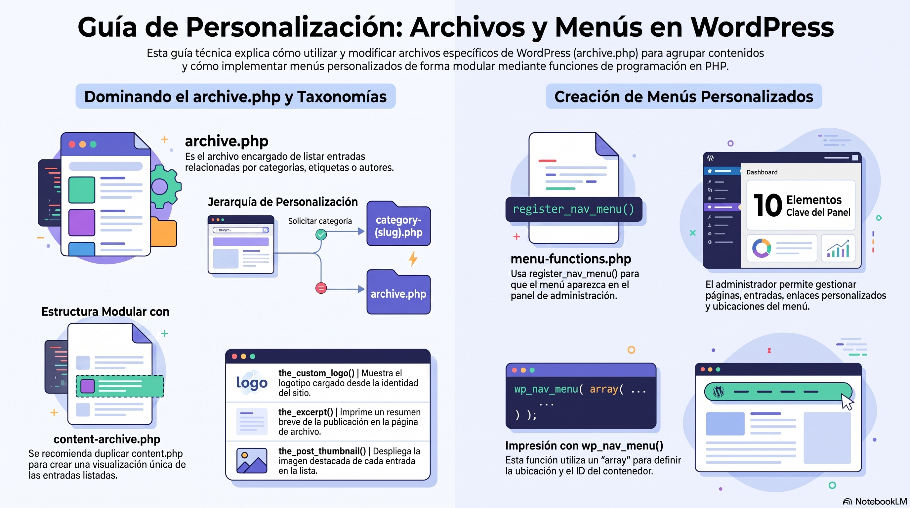

# Semana 04 - Comprendiendo Nuevos Archivos de WordPress

**Experiencia:** 2 | **Asignatura:** Administración de Contenidos

---

## Introducción

Esta semana se trabaja con las páginas de archivo (`archive.php`) y los menús de WordPress. Se aprende a agrupar y mostrar entradas por categoría, y a registrar y personalizar menús de navegación desde el panel de administración y mediante código PHP.

[Descargar presentación](material-clase/presentacion.pdf)
---

## Temas Tratados

- Estructura de una página `archive.php` de WordPress
- Modificando el `archive page` de WordPress
- Personalización para mostrar categorías específicas (`category.php`)
- Personalización del menú de WordPress
- Panel de administración: configuración de menús
- Imprimiendo el menú con `wp_nav_menu()`

## Conceptos Clave

- **archive.php:** plantilla que agrupa y muestra entradas relacionadas (por categoría, etiqueta, fecha, autor).
- **category.php:** plantilla específica para páginas de categoría.
- **wp_nav_menu():** función que renderiza menús de navegación registrados.
- **register_nav_menus():** función que declara las ubicaciones de menú del tema.
- **the_custom_logo():** función que muestra el logotipo del sitio configurado desde el panel.

## Resultado de Aprendizaje

- **RA1:** Evalúa estructura de contenidos de un proyecto digital mediante mapa de navegación.
- **RA3:** Arma plantilla personalizada en servidor local y remoto.

## Referencias y Recursos

- Material Guía Semana 4: `material-semana/material-guia-semana.pdf`
- [wp_nav_menu()](https://developer.wordpress.org/reference/functions/wp_nav_menu/)
- [Template Hierarchy - archive.php](https://developer.wordpress.org/themes/basics/template-hierarchy/#category)
